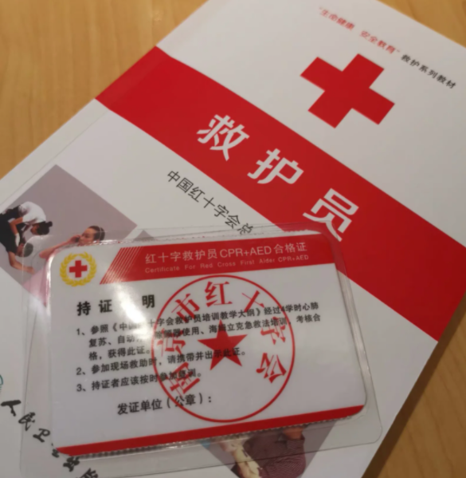

black完结力，爷青结

 工作细胞作为一部真正优秀的科普番剧，他做到了非常不容易的一点。

一般的科普教育很难让人能够接受，俗称听不进去。但是拟人化能够让观众感受到共情，情节渲染到位，角色合情合理。基本知识上做到了正确，也能够让观众真正的去感受到健康的重要性 最后一集的心肌梗塞，近年来有年轻化的趋势，作为重要的急救设备AED的使用也普及的不到位。

例如日本驾照是需要考心肺复苏和AED的使用的，我国也可以参考。现实中民众普及急救知识，救护电话的打法，以及法律对于专业或非专业急救人员的保护，都是需要时间的 细说就很复杂了，最后还是祝大家身体健康

——2021.03.21

------

联动以前讲工作细胞black的感悟
正好最近有空，今天就去南京红十字学了CPR和AED
哪怕在南京是免费的，全南京市也不过4%~5%的人会这些技能
希望以后会变得更好吧

