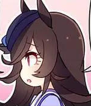

## 一开始确实我也没想到，看的这么入迷

[^只要我穿上这身铠甲，就没有什么能够伤害到我]: 
[^我已经 没法像那样奔跑了 摘下头盔 流泪猫猫头  呜呜呜呜呜呜呜呜，制作组你没有心，帝王，我的帝王]: 

虽然说这个是一个梗，但是吧，让我这么用心去安利和推荐的。除了86-不存在的战区以外，也就是末日三问了，也可能是刚看完的惊喜。但是确确实实，赛马娘2在2021年原创番剧中，又或者说在日漫历史上，都将占据一定的位置。

就如我以前在Eclipse那篇博文中提到的一样，我认为现实向番剧很难做好，因为剧透不可避免，尤其是赛马娘这样的结果导向，导致观感可能会不佳，再加上这是一部游戏宣传向番剧，我一开始是不看好的。

暑假实在是太无聊了，所以正好找来了赛马娘看了看。第一部偏向于比赛，适合从未了解过赛马的观众，同时已经确定要补番的观众观看，为什么我要这么说呢，因为上面提到的种种debuff，导致了这部番剧的受众很少。

如果是只想体验，或者是说想要了解什么这部番会让人变得如此疯狂的人，适合从第二部来进行观看。

所以说，第二部的受众会稍微大很多。

## 赛马娘2讲了什么

这个问题，很好回答，番剧的简介就已经回答了这个问题。

但是深层次的去看，第二季着重刻画了东海帝皇的故事。对于这种真实故事改编来说，虚拟和真实的互动会给我们带来不一样的感受。有很多的故事，已经是20年前的事情了，而这些故事在cygames的魔改下，发生在当下。

日本动画业极其擅长人物的刻画和成长。而赛马这项体育竞技运动，在追求更快更强的同时，总会避免不了伤痛和遗憾 如果只是还原历史，则是纪录片，而cygames这次给赛马们赋予了人形，有了生命的意义和命运的安排 

起点到终点的故事，除了汗水和努力外，还有梦想和遗憾。正如奥林匹克精神一样，你不能说，运动员为了取得一个好名次损伤身体，顶着疫情参加奥运会不值得之类的。因为你我都知道，奥林匹克精神是更高更快更强以及更团结，马娘们团结在一起，能够互相鼓励，互相为对方感到开心。这也是各国运动员比赛结束后的写照，我们尊重强者。

但是赛马这项运动，是夹杂着赌博，假赛，伤痛的赛事，在光鲜的背后，是得病可能就会退出赛场之类残酷的现实，在动画中，并没有太强调这些。cygames让我们更加注重比赛精神这一块，让我们被马娘们比赛的冲劲，伙伴之间的羁绊而感动，配合无敌的手绘live，以及一颦一笑非常细腻的表情变化。让观众沉浸其中，获得不一样的追番体验。

## 何为永不言败

“现场助威声响成一片！ 双涡轮不顾一切地领跑 究竟拉开了多少马位 通过实况画面实在不好说 她保持着巨大的优势一马当先 双涡轮领跑！双涡轮大幅领跑！ 涡轮引擎今天依旧全开！ 进入三号弯依然没有停止加速！ 燃烧全部体能尽力猛跑！ 个性派逃亡者双涡轮领先！”

我敲下这段话，眼泪也夺眶而出。cy仿佛带我们进入了比赛中，与ta们一起奔跑，冲刺，一起享受成功和失败，还有梦想的份量。双涡轮能够一马当先，她证明了不可能也可能成为可能，编剧用这个巧妙的方式告诉我们，既然ta们也能做到，有着东海帝皇一样坚强的内心的人也一定不会轻易放弃，谢谢你cygames。

## 何为胜利

嘘声是给挑战者的勋章，因为你的名字是米浴，你是我的英雄。

在东海帝皇剧情爆点之前，有米浴给我们先带来一个感情起伏。胜利是什么，可以为了自己的胜利而不管他人的付出吗，这个问题很矛盾。如果你有这个想法，或者你被米浴的故事感动，那么我想你一定是一个温柔的人。

## 写在最后

看过赛马娘2的人，可以说可惜。因为这部番剧太优秀了，你很难找到有相关的竞品。

推荐不要看赛马娘2，这样你以后还会觉得别的片不错

赛马娘这部番，比较适合更成熟，更聪明，更帅气，更温柔，更有才华，更有气质的观众观看呢 

虽然说是玩梗，但是我觉得，任何热爱动画ACG的人，都应该去试试看。

