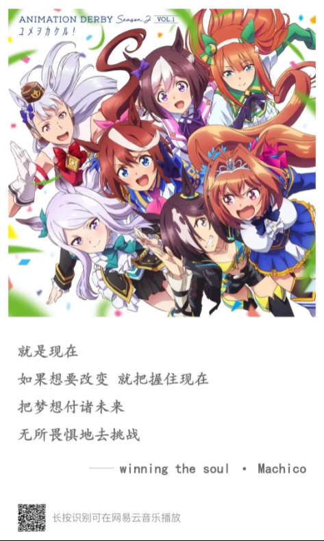

对于赛马来说，一开始我确实是不感兴趣的，毕竟还是太小众了点 

而作为赛马娘来说，第二季着重刻画了东海帝皇的故事。对于这种真实故事改编来说，虚拟和真实的互动会给我们带来不一样的感受

有很多的故事，已经是20年前的事情了，而这些故事在cygames的魔改下，发生在当下。

日本动画业极其擅长人物的刻画和成长。而赛马这项体育竞技运动，在追求更快更强的同时，总会避免不了伤痛和遗憾 如果只是还原历史，则是纪录片，而cygames这次给赛马们赋予了人形，有了生命的意义和命运的安排 

起点到终点的故事，除了汗水和努力外，还有梦想和遗憾 

Eclipse first，the rest nowhere--一马当先，万马无光 

你看这个特别周，就知道哭，太逊力 特别周竟是我自己

