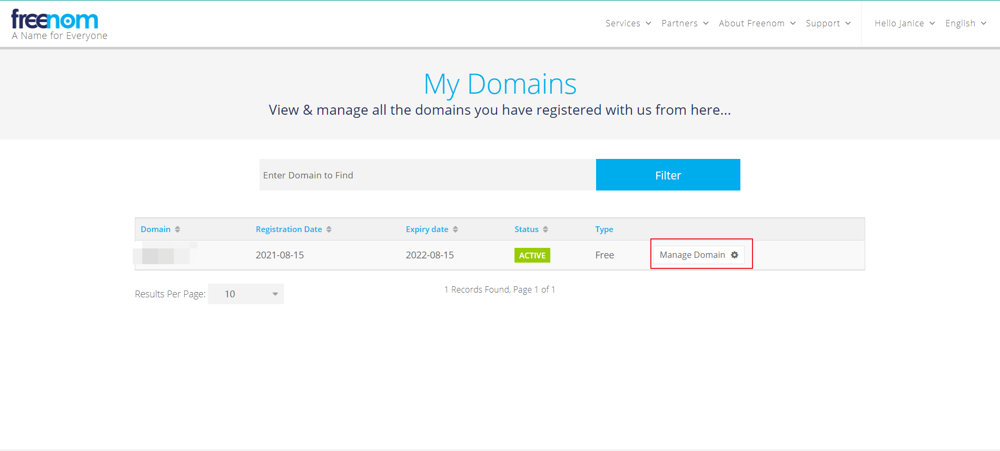
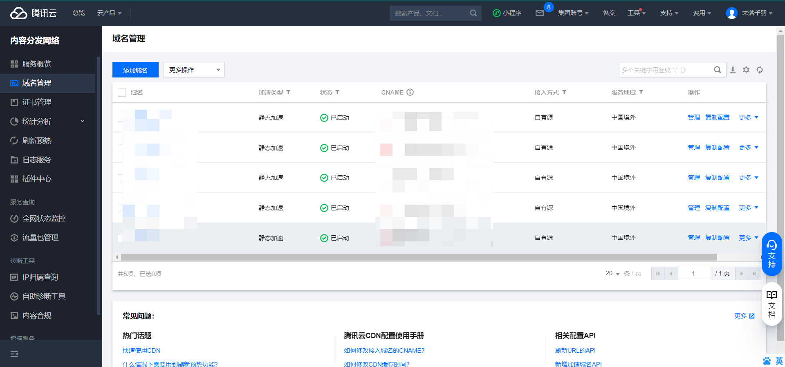
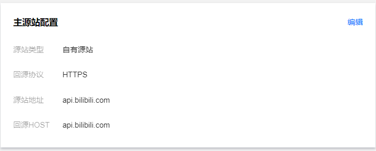
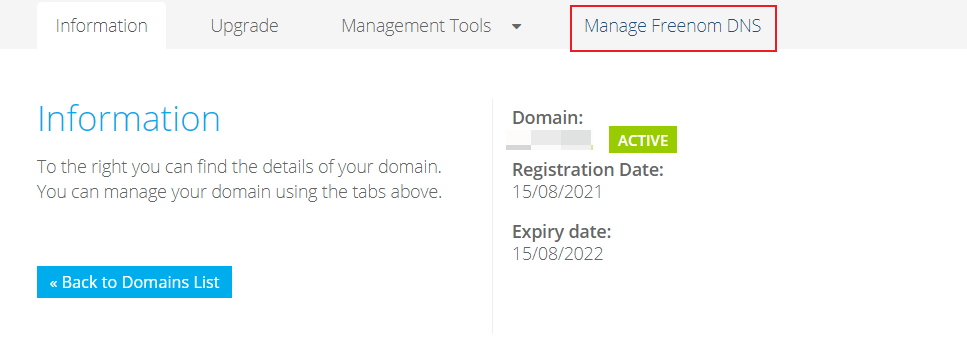
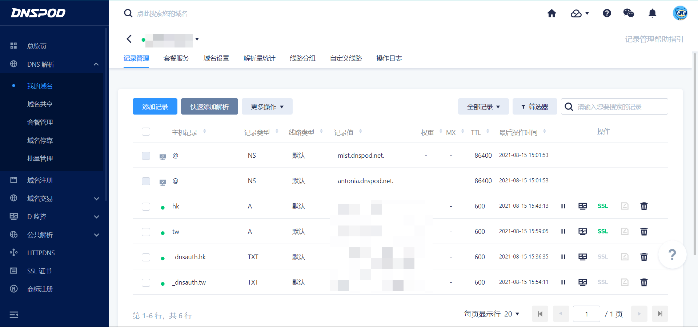

## 引言

之前7月份叔叔更新了播放器，我以前是通过阿里云PHP函数的形势代理番剧的，速度不是很快但是能用，没有CDN这个这么麻烦，但是叔叔更新播放器之后导致PHP函数失效，照着教程改了半天也不行，于是就参考了这个教程进行了一波操作，非常的成功。

```
https://www.lovewx.club/%e4%bd%bf%e7%94%a8%e8%85%be%e8%ae%af%e4%ba%91cdn%e8%a7%a3%e9%99%a4%e5%93%94%e5%93%a9%e5%93%94%e5%93%a9%e7%95%aa%e5%89%a7%e5%8c%ba%e5%9f%9f%e9%99%90%e5%88%b6/#toc-head-9  
使用腾讯云cdn解除哔哩哔哩番剧区域限制
```


## 域名准备

首先是去腾讯云注册实名认证，域名我建议使用freenom等免费域名网站



请注意一定要使用对应ip的对应身份，可以百度自己梯子后的ip，ping一下之后可以用虚拟生成器

```
 http://www.haoweichi.com/Index/custom_result 虚拟身份生成
```

然后就可以在freenom上申请到一年的免费域名，到期之前会给你发邮件续期。

## 导入域名

根据你要加速的位置，在域名前添加hk，tw等字样



服务位置设置为境外



然后申请证书，实名认证之后匹配，这块教程里面写的很详细

## Dnspod设置



在freenom中设置dns地址为dnspod解析地址之后操作类似这样



主机记录和记录值为腾讯云管理台给出，参考教程即可

添加CNAME之后使用17ce的ping选地址，删除CNAME之后

把对应解析地区ip云服务器地址填到对应hk或tw记录值处

我更推荐的是tw地区，怎么查看呢，需要你得到具体的番剧地址才可以，知乎上有

```
https://zhuanlan.zhihu.com/p/392889727 B站港澳台番剧播放地址（2021年）
```

只要86-不存在的战区可以播放，基本上其他的都差不多，可能这个番港区没有只有台区有吧

然后就可以用你的链接地址填入油猴脚本，这样你就可以快乐看番了

## 写在最后


感谢笑靥如花的乐园的教程，本文在基础上给予了一些建议和解释