Java的基本数据类型：八个整型：4个byte  short  int  long浮点型：2个float  double字符型：1个char布尔型：1个boolean除基本数据类型以外的类型叫引用类型：String,类，数组，接口…包装类：Byte  Short  Integer   Long  Float  Double   Character   Boolean

 

字符使用单引号引起来：‘\n’，转义字符，表示回车或者换行。在Java中，两个浮点型，默认的是使用double，所以3.14和1.0都默认是double类型。如果要使用float类型，在浮点数值后加上f或者F,例如：3.14F或者1.0f，这个表示float类型。一般推荐使用小写的f。在Java中4个整型，默认使用int。如果要使用长整型，在数值后面加上l或者L，例如：20l或者20L。推荐使用L。

 

成员变量（成员属性，全局变量）：直接声明在类中的变量，成员变量在定义的时候，如果不手动初始化，则会有默认值，默认初始化，int类型，默认值是0，double默认值是0.0，String类型默认值是null。局部变量：声明在方法或者代码块中的变量叫做局部变量。局部变量在声明的时候必须给初始值，不会有默认值。

 

封装：将类中声明的属性隐藏起来（私有化，private修饰）,让外界无法直接访问，提供get/set方法给外界调用，间接访问属性。取值用get方法，get方法的命名：get+首字母大写的属性名：name   getName()赋值用set方法，set方法的命名：set+首字母大写的属性名：name  setName()注意：在boolean类型中，get方法可以写成isName()方式。

 

方法的重载：相同的方法名，执行不同的功能条件：与访问修饰符无关与返回值无关方法名必须相同参数列表必须不同，数量，和形参类型不同。 自动类型转换：小（所占空间）像大转换强制类型转换：大向小转换，存在精度的损失 charàintlongàdoubleint和char之间的转换按照美国信息标准交换码去转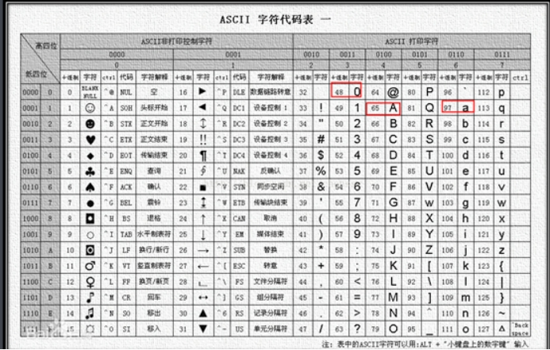 

 

访问修饰符的范围：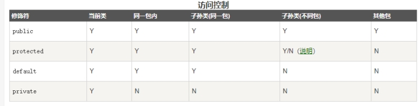 

 

try{}catch{}finally{}执行顺序：try中的代码块，如果遇到异常，则会走入catch块中，根据产生的异常的不同，走到能捕获到该异常的catch，finally块中的代码，除了少数几种情况外，不论任何，都会执行

 

abstract能修饰类：抽象类，需要被继承，子类继承抽象类需要实现抽象类中所有的抽象方法，不重写所有的抽象方法的情况只有一种，子类也是抽象类。abstract能修饰方法：抽象方法，没有方法，需要被重写。接口：接口也需要被实现，子类可以实现接口，需要重写接口中全部的方法，不重写的情况只有一个，子类是抽象类，接口能继承接口。final:最终的，最后的能修饰类：最终类，无法被继承能修饰属性：最终属性，不能再修改，和static连用，叫常量。能修饰方法：最终的方法，不能被重写。static:静态的，随着类的加载而加载static不能访问非static的属性或者方法非static能访问static属性或方法

 

自增自减运算符：前++：++a先自增，再参与其他运算后++：a++先参与其他运算，再自增前--：--a后--：a--

 

==和equals()的区别：==：比较的地址（引用）equals()：比较的是地址（引用）特别的：在String类中，equals()方法被重写了，equals比较的是值。

 

split()根据给定的字符串或者正则表达式将字符串拆分成字符串数组。[\\s](file:///\\s)：正则表达式，表示空格，回车等空白字符

 

数组在定义之后如果没有给值，会有默认值。int类型，默认值是0，double默认值是0.0，String类型默认值是null。数组的长度在定义的时候给定，也可以在定义的时候给默认值，给了多少默认值长度就是多少。数组的下标从0开始。

 

所有静态的属性或者方法都可以通过类名.属性或者类型.方法名()直接调用。

 

重写：要有继承才能重写重写的条件：子类的访问修饰符不能严于父类子类返回值类型必须和父类相同或者是父类的子类（不能严于父类）子类的方法名要和父类相同子类抛出的遗产不能严于父类（运行时异常除外）总结：除了名称外，都不能严于父类 补充：异常：所有异常的父类为Exception，Exception 下面分为运行时异常和编译时异常，自定义异常一般要继承Exception

 

对象之间的赋值其实给的是地址：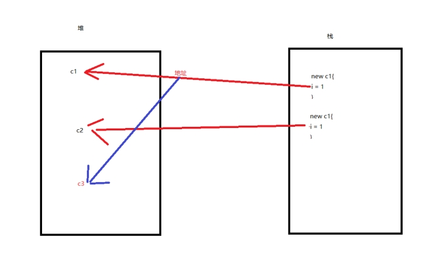

 

static和final同时修饰的量叫常量，常量名一般规定全部要大写

 

局部变量只在当前{}中有效，出了{}就无法访问

 

 

1) **请说出异常的类型有那些？并列举至少3个常见的异常。**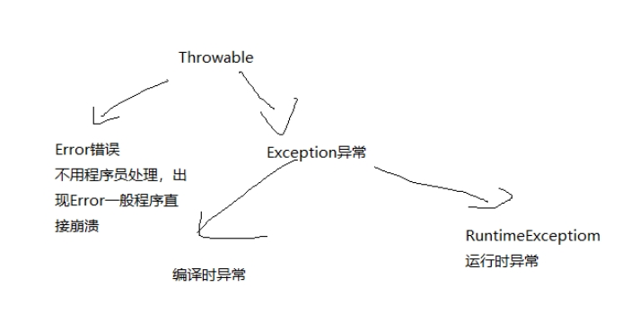NullpointException（空指针异常）ClassNotFoundException（类找不到异常）ClassCastException（类型转换异常）IllegalArgumentException（非法参数异常）ArithmeticException（算术异常）NumberFormatException（数据格式异常）IndexOutOfBoundsException（数组下标越界异常）

 

2) **请简述什么是重写并写出实现JAVA重写的要求。**重写：子类继承父类方法，能用则用，不能用就重写。子类的访问修饰符不能严于父类子类返回值的类型必须和父类相同或者是父类返回值类型的子类（不能严于父类）子类的方法名和父类要一样子类参数要和父类一样子类抛出的异常不能严于父类（和父类一样或者是父类异常的子类）（运行时异常除外） 

 

3) **请简述继承的基本概念并说明接口能否被类继承？接口能否继承多个接口？**继承：子类得到父类的共有属性和方法叫继承。接口不能被类继承，类可以实现接口，并同时实现多个接口接口可以继承接口，并可以多继承接口

 

4) **String如何与字符数组相互转换？String如何与字节数组相互转换？（分别写出对应的方法）**Stringà字符数组: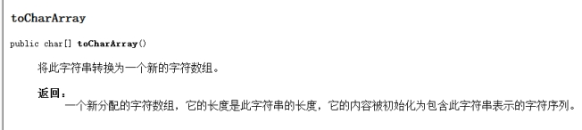 字符数组àString：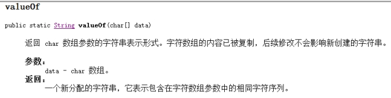 构造方法：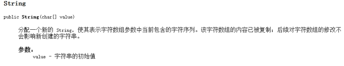 Stringà字节数组：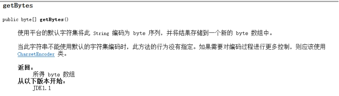 字节数组àString: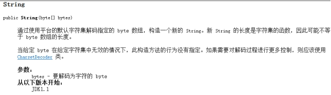 

 

5) **接口和抽象类的区别 请详细说明（至少说出3点区别）。**接口不能直接实例化，必须要类去实现接口，然后实例化类，抽象类需要类继承，子类实例化父类。接口中不能有成员属性，抽象类中可以有成员属性接口中的方法的访问修饰符只能是public abstract，其他都不行，抽象类中可以有非抽象方法，也就是可以有其他访问修饰符修饰的方法接口没有构造方法，抽象类有构造方法。

 

1)	编写一个方法，输入一串字符串，格式为alpha_Beta_double以下划线分隔，要求实现将该字符串转换为：AlphaBetaDouble的格式，将下划线分隔的单词拼接并将单词的首字母转换为大写。请写入该方法的完整实现代码，要求使用规范的变量命名 

 

2） 实现数组复制，数组a 内容{ 1,2,3,4,5,6}到数组b,请初始化数组a和数组b,并将数据a的内容复制给数据b。提示：使用System.arraycopy();使用两种方法实现数组拷贝 

 

3)编写一个排序程序，输入一个学生（Student）对象集合，要求输出一个集合中学生的信息，集合中的对象按成绩进行升序排序，成绩并列的按照学号先后顺序排列。已知的学生对象数据为：学号 姓名  成绩 1   小明  78 2   小兵  75 3   小芳  89 4   小雨  75 5   小吴  78 6   小虎  92 请写出完整设计思路（伪代码）或实现代码。思路：首先要有一个学生类，要有学号，姓名，成绩三个属性。排序有两种方式：第一种，实现Comparator类（1.创建比较类实现该接口2使用匿名内部类在调用的时候实现该接口）第二种：实现Comparable类（1.创建比较类实现该接口2使用匿名内部类在调用的时候实现该接口）如果是数组：Arrays.sort()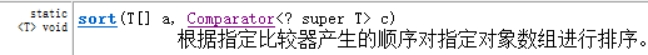 这里是集合：Collections.sort()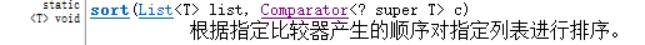 

 

Java基本数据类型所占字节数：byte    1字节short   2字节int     4字节long    8字节float    4字节double   8字节char    2字节  正好可以存储一个汉字boolean  可以认为1个字节 1个字节等于8个bit位取值范围的公式：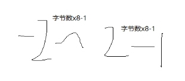

 

Java当中的字符创遇到加好就是拼接的意思，将两个字符串拼接在一起成为一个字符串，但是没有减号能缩短字符串一说Java字符串取出其中一个字符，不能直接用中括号取值，没有这种写法，想要取出字符串中的一个字符，需要用到一个方法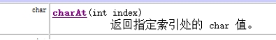

 

方法（函数）在创建的时候不执行， 在调用的时候才执行。

 

局部变量的优先级高于成员变量（全局变量），前提是局部变量的变量名和成员变量相同

 

boolean类型的成员变量的默认值是false

 

多态：子类创建父类对象，父类引用指向子类对象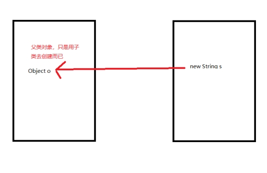自动类型转换：小（子类）像大（父类）转强制类型转换：大向小转

 

构造方法：和类名相同名称的方法，没有返回值构造代码块：写在类当中，用{}括起来的代码块叫构造代码块，功能和构造方法类似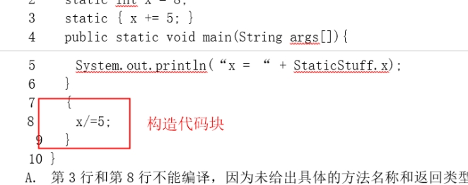 静态代码块：写在类当中，用{}括起来，前面使用static修饰的代码块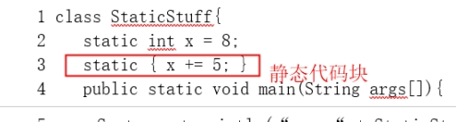 静态变量：使用static修饰的变量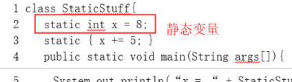 作用：构造方法：每创建一次对象（new）就会执行一次构造方法构造代码块：和构造方法类似，每创建一次对象（new）就会执行一次构造代码块静态代码块：始终只会执行一次，随着类的加载而加载 执行顺序：静态代码块（只执行一次)>构造代码块>构造方法静态代码块和静态变量直接谁先执行呢：按照书写的顺序执行，谁写在上面谁先执行。

 

instanceof:运算符对象 instanceof 类:用来判断对象是否属于该类，注意子类对象是属于父类对象的。如果属于则结果为true,反之为false。

 

不能将boolean类型的值转换成其他基本数据类型

 

1) char型变量中能不能存贮一个中文汉字?如果能，是如何储存的，采用的编码是什么?能存储汉子，两个字节，采用unicode编码3 如何实现序列化？如何实现线程的同步？ 实现序列化接口Serializable，使用线程同步关键字synchronize. 

 

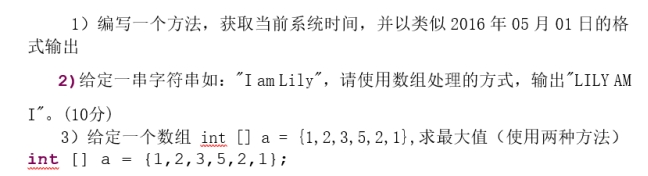 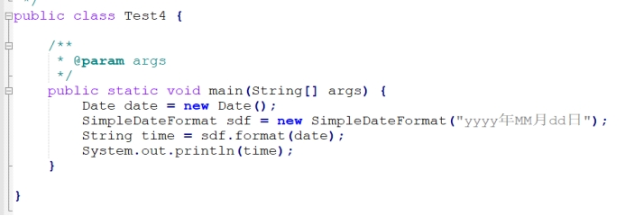 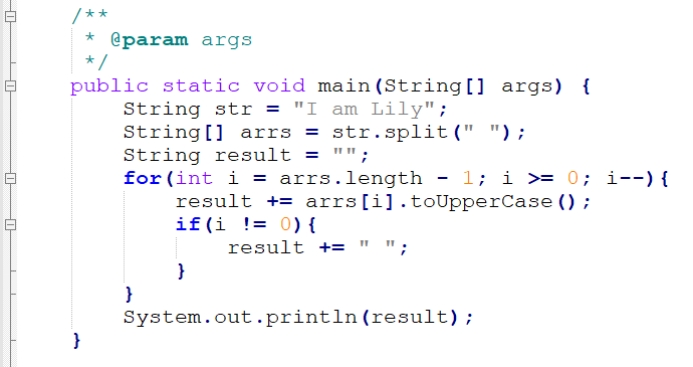 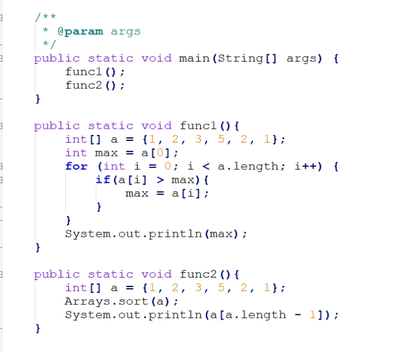 

 

/:用来做除法的，当除数和被除数都是整型的时候，进行的是取整运算，当除数和被除数有一个是浮点数，则会进行自动类型转换，整数像浮点数转换，所以结果会出现小数。(double)16/5=3.2

 

八进制：以0开头   十六进制：以0x或者0X开头

 

Java标识符的命名规则： 只能包含字母，数字，下划线不能以数字开头不能是Java的关键字和保留字不推荐使用汉语拼音不推荐使用汉字（其实汉字能用）推荐使用驼峰命名法（大驼峰和小驼峰）《阿里巴巴开发手册》：推荐只是用字母和数字，不要出现_和$命名一定要见名知意

 

多态的三要素：继承方法的重写，子类重写父类方法父类引用指向子类对象

 

多态的特性：成员变量（属性）：编译看左边（父类），执行看左边（父类）：子类创建父类对象实质就是个父类对象，只是套用了子类创建而已成员方法：编译看左边（父类），执行看右边（子类）方法的重写静态方法：不存在重写，意味着没有左边右边构造方法：不存在重写

 

ArrayList底层使用数组实现的LinkedList底层使用链表实现的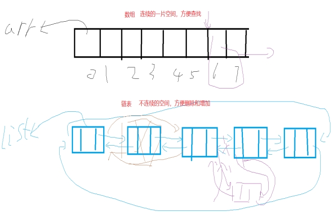

 

从jdk1.8开始接口中可以有静态方法和变量，但一般不用不加修饰的变量默认为常量不加修饰的抽象方法默认public abstract修饰

 

一个类只能有一个父类，但可以同时实现多个接口，接口和接口之间可以多继承。

 

break用于结束当前循环continue用于结束当次（本层）循环

 

请简述final,finally,finalize关键字的区别。final：最终的，最后的，访问修饰符，可以修饰属性，方法和类，表示最终属性，方法或者类finaly：异常里捕获异常，一般情况下一定会执行的语句块finalize:Object里面的一个方法，和立即回收有关

 

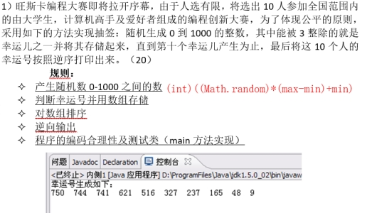 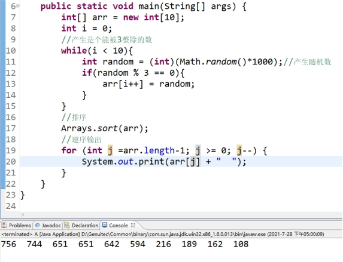

